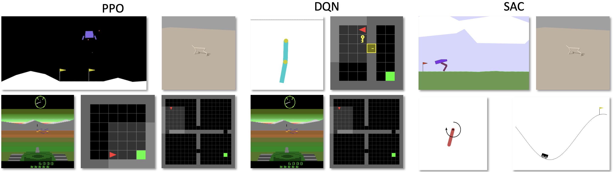

<p align="center">
    <a href="./docs/images/logo_lm.png#gh-light-mode-only">
        
    </a>
    <a href="./docs/images/logo_dm.png#gh-dark-mode-only">
        
    </a>
</p>

<div align="center">
    
<!--- [](https://pypi.python.org/pypi/arlbench) -->


[](https://github.com/automl/arlbench/actions/workflows/pytest.yaml)
[](https://github.com/automl/arlbench/actions/workflows/docs.yaml)
    
</div>

<div align="center">
    <h3>
      <a href="#features">Features</a> |
      <a href="#installation">Installation</a> |
      <a href="#quickstart">Quickstart</a> |
      <a href="#experiments">Experiments</a> |
      <a href="#cite-us">Cite Us</a>
    </h3>
</div>

---

# 🦾 Automated Reinforcement Learning Benchmark

The ARLBench is a benchmark for HPO in RL - evaluate your HPO methods fast and on a representative number of environments! For more information, see our [documentation](https://automl.github.io/arlbench/main/).

## Features

- **Lightning-fast JAX-Based implementations of DQN, PPO, and SAC**
- **Compatible with many different environment domains via Gymnax, XLand and EnvPool**
- **Representative benchmark set of HPO settings**

<p align="center">
    <a href="./docs/images/subsets.png">
        
    </a>
</p>

## Installation

There are currently two different ways to install ARLBench.
Whichever you choose, we recommend to create a virtual environment for the installation:

```bash
conda create -n arlbench python=3.10
conda activate arlbench
```

The instructions below will help you install the default version of ARLBench with the CPU version of JAX.
If you want to run the ARLBench on GPU, we recommend you check out the [JAX installation guide](https://jax.readthedocs.io/en/latest/installation.html) to see how you can install the correct version for your GPU setup before proceeding.

<details>
<summary>PyPI</summary>
You can install ARLBench using `pip`:

```bash
pip install arlbench
```

If you want to use envpool environments (not currently supported for Mac!), instead choose:

```bash
pip install arlbench[envpool]
```

</details>

<details>
<summary>From source: GitHub</summary>
First, you need to clone the ARLBench reopsitory:

```bash
git clone git@github.com:automl/arlbench.git
cd arlbench
```

Then you can install the benchmark. For the base version, use:

```bash
make install
```

For the envpool functionality (not available on Mac!), instead use:

```bash
make install-envpool
```

</details>

> [!CAUTION]
> Windows is currently not supported and also not tested. We recommend using the [Linux subsytem](https://en.wikipedia.org/wiki/Windows_Subsystem_for_Linux) if you're on a Windows machine.

## Quickstart

Here are the two ways you can use ARLBench: via the command line or as an environment. To see them in action, take a look at our [examples](https://github.com/automl/arlbench/tree/main/examples).

### Use the CLI

We provide a command line script for black-box configuration in ARLBench which will also save the results in a 'results' directory. To execute one run of DQN on CartPole, simply run:

```bash
python run_arlbench.py
```

You can use the [hydra](https://hydra.cc/) command line syntax to override some of the configuration like this to change to PPO:

```bash
python run_arlbench.py algorithm=ppo
```

Or run multiple different seeds after one another:

```bash
python run_arlbench.py -m autorl.seed=0,1,2,3,4
```

All hyperparamters to adapt are in the 'hpo_config' and architecture settings in the 'nas_config', so to run a grid of different configurations for 5 seeds each , you can do this:

```bash
python run_arlbench.py -m autorl.seed=0,1,2,3,4 nas_config.hidden_size=8,16,32 hp_config.learning_rate=0.001,0.01
```

We recommend you create your own custom config files if using the CLI (for more information on this, checkout [Hydra's guide to config files](https://hydra.cc/docs/tutorials/basic/your_first_app/config_file/)). Our [examples](https://github.com/automl/arlbench/tree/main/examples) can show you how these can look.

### Use the AutoRL environment

If you want to have specific control over the ARLBench loop, want to do dynamic configuration or learn based on the agent state, you should use the environment-like interface of ARLBench in your script.

To do so, import ARLBench and use the `AutoRLEnv` to run an RL agent:

```python
from arlbench import AutoRLEnv

env = AutoRLEnv()

obs, info = env.reset()

action = env.config_space.sample_configuration()
obs, objectives, term, trunc, info = env.step(action)
```

Just like with RL agents, you can call 'step' multiple times until termination (which you define via the AutoRLEnv's config). For all configuration options, check out our [documentation](https://automl.github.io/arlbench/main/).

## Experiments

### Reproduce Landscaping & Optimizer Runs

The commands for the landscape analysis are stated in `runscripts/landscaping_commands.sh`.
The commands for the optimizer runs as part of the subset validation are stated in `runscripts/optimizer_commands.sh`.

The landscaping results will be stored in `results/sobol`.

All aggregated results are stored in `results_combined`.

To aggregate the landscaping results, run:

```bash
python runscripts runscripts/aggregate_results_landscaping.py sobol
```

The script creates a file called `runhistory_combined.csv` for each experiment.

To aggregate the optimizer results, run

```bash
python runscripts runscripts/aggregate_results_optimizers.py <optimizer>
```

where optimizer can be one of `<rs|pbt|smac|smac_mf>`.

### Reproduce Subset Selection and Subset Validation

For the subset selection and validation, you need to have all results from this repo in the `results_combined` directory.

All

To run the subset selection, you can run:

```bash
python runscripts subset_selection/subset_selection.py
```

To run the subset validation, you can run:

```bash
python runscripts subset_validation/subset_validation.py
```

### Plots and other experiments

To reproduce everything we have in the paper, you need all available results (Sobol landscaping + optimizer runs) in `results`.
It needs to have the following structure:

```
results/
│
├── pbt/
│   ├── dqn_Acrobot-v1
│   │   ├── 0
│   │   ├── 1
│   │   ├── 2
│   │   └── runhistory_combined.csv
│   ├── ...
│   └── ...
│
├── rs/
│   ├── dqn_Acrobot-v1
│   │   ├── 0
│   │   ├── 1
│   │   ├── 2
│   │   └── runhistory_combined.csv
│   ├── ...
│   └── ...
│
├── smac/
│   ├── dqn_Acrobot-v1
│   │   ├── 0
│   │   ├── 1
│   │   ├── 2
│   │   └── runhistory_combined.csv
│   ├── ...
│   └── ...
│
├── smac_mf/
│   ├── dqn_Acrobot-v1
│   │   ├── 0
│   │   ├── 1
│   │   ├── 2
│   │   └── runhistory_combined.csv
│   ├── ...
│   └── ...
│
└── sobol/
    ├── dqn_Acrobot-v1
    │   ├── 0
    │   ├── 1
    │   ├── 2
    │   └── runhistory_combined.csv
    └── ...

```

The optimizer data is stored in `results_finished/<optimizer>/<algorithm_environment>.zip`. By unzipping all files for each optimizer in `results/<optimizer>`, you achieve the structure as shown above.

For sobol, you have to unzip all zip files in `results_finished/sobol/<category>` inside the `results/sobol_landscaping` directory.

Then runtime experiments can be found in `results_finished/runtime_experiments` and need to be extracted in `results/runtime_experiments`.

To aggregate the landscaping results, run:

```bash
python runscripts runscripts/aggregate_results_landscaping.py sobol
```

The script creates a file called `runhistory_combined.csv` for each experiment.

To aggregate the optimizer results, run

```bash
python runscripts runscripts/aggregate_results_optimizers.py <optimizer>
```

where optimizer can be one of `<rs|pbt|smac|smac_mf>`.

To store all the figures, make sure to have this folder structure for the `plots` directory:

```
plots/
│
├── subset_validation/
│   └── optimizer_runs/
│   │   ├── single_runs
│   │   └── subsets
│
├── subset_selection
│
└── runtime_experiments
    ├── <experiments>
    └── ...

```

You can then use the following scripts to create the figures and statistics:

```bash
python subset_validation/plot_optimizers_over_time.py
python runtime_comparisons/plot_runtime_comparisons.py
python runtime_comparisons/plot_runtime_experiments.py
```

## Cite Us

If you use ARLBench in your work, please cite us:

```bibtex
@misc{beckdierkes24,
  author    = {J. Becktepe and J. Dierkes and C. Benjamins and D. Salinas and A. Mohan and R. Rajan and F. Hutter and H. Hoos and M. Lindauer and T. Eimer},
  title     = {ARLBench},
  year      = {2024},
  url = {https://github.com/automl/arlbench},
```
