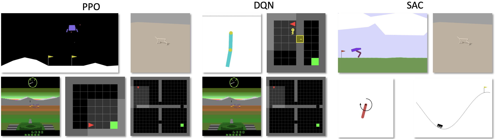

<p align="center">
    <a href="./docs/images/logo_lm.png#gh-light-mode-only">
        
    </a>
    <a href="./docs/images/logo_dm.png#gh-dark-mode-only">
        
    </a>
</p>

<div align="center">
    <h3>
      <a href="#features">Features</a> |
      <a href="#installation">Installation</a> |
      <a href="#quickstart">Quickstart</a> |
      <a href="#cite-us">Cite Us</a>
    </h3>
</div>

---

# 🦾 Automated Reinforcement Learning Benchmark

The ARLBench is a benchmark for HPO in RL - evaluate your HPO methods fast and on a representative number of environments!

## Features

- **Lightning-fast JAX-Based implementations of DQN, PPO, and SAC**
- **Compatible with many different environment domains via Gymnax, XLand and EnvPool**
- **Representative benchmark set of HPO settings**

<p align="center">
    <a href="./docs/images/subsets.png">
        
    </a>
</p>

## Installation

There are currently two different ways to install ARLBench.
Whichever you choose, we recommend to create a virtual environment for the installation:

```bash
conda create -n arlbench python=3.10
conda activate arlbench
```

The instructions below will help you install the default version of ARLBench with the CPU version of JAX.
If you want to run the ARLBench on GPU, we recommend you check out the [JAX installation guide](https://jax.readthedocs.io/en/latest/installation.html) to see how you can install the correct version for your GPU setup before proceeding.

<details>
<summary>PyPI</summary>
You can install ARLBench using `pip`:

```bash
pip install (redacted for peer-review)
```

If you want to use envpool environments (not currently supported for Mac!), instead choose:

```bash
pip install (redacted for peer-review)[envpool]
```

</details>

<details>
<summary>From source: GitHub</summary>
First, you need to clone the ARLBench reopsitory:

```bash
git clone (redacted for peer-review)
cd xxx
```

Then you can install the benchmark. For the base version, use:

```bash
make install
```

For the envpool functionality (not available on Mac!), instead use:

```bash
make install-envpool
```

</details>

> [!CAUTION]
> Windows is currently not supported and also not tested. We recommend using the [Linux subsytem](https://en.wikipedia.org/wiki/Windows_Subsystem_for_Linux) if you're on a Windows machine.

## Quickstart

Here are the two ways you can use ARLBench: via the command line or as an environment.

### Use the CLI

We provide a command line script for black-box configuration in ARLBench which will also save the results in a 'results' directory. To execute one run of DQN on CartPole, simply run:

```bash
python run_arlbench.py
```

You can use the [hydra](https://hydra.cc/) command line syntax to override some of the configuration like this to change to PPO:

```bash
python run_arlbench.py algorithm=ppo
```

Or run multiple different seeds after one another:

```bash
python run_arlbench.py -m autorl.seed=0,1,2,3,4
```

All hyperparamters to adapt are in the 'hpo_config' and architecture settings in the 'nas_config', so to run a grid of different configurations for 5 seeds each , you can do this:

```bash
python run_arlbench.py -m autorl.seed=0,1,2,3,4 nas_config.hidden_size=8,16,32 hp_config.learning_rate=0.001,0.01
```

### Use the AutoRL environment

If you want to have specific control over the ARLBench loop, want to do dynamic configuration or learn based on the agent state, you should use the environment-like interface of ARLBench in your script.

To do so, import ARLBench and use the `AutoRLEnv` to run an RL agent:

```python
from xxx import AutoRLEnv

env = AutoRLEnv()

obs, info = env.reset()

action = env.config_space.sample_configuration()
obs, objectives, term, trunc, info = env.step(action)
```

Just like with RL agents, you can call 'step' multiple times until termination (which you define via the AutoRLEnv's config).
