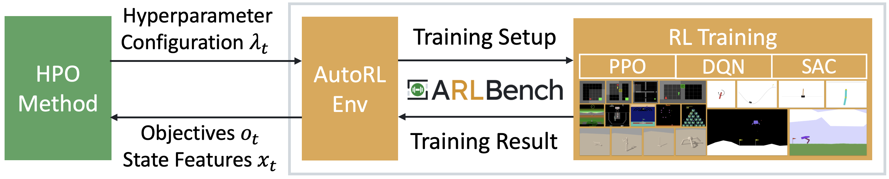

ARLBench
========

.. toctree::
   :hidden:
   :maxdepth: 2

   installation
   examples/index
   basic_usage/index
   advanced_usage/index
   api
   glossary
   faq
   :caption: Contributing to ARLBench:

   CONTRIBUTING.md

Welcome to ARLBench, your pathway into efficient AutoRL!
We offer lightning-fast implementations of PPO, DQN and SAC that are highly configurable as well as a subset of environments which will give you a representative result of your AutoRL method across the RL landscape.
This documentation, in combination with our examples, should provide you with a starting point to get your AutoRL method up and running in no time.

You will interact with ARLBench through the `AutoRL Environment` class, which is the main entry point for all the functionalities that ARLBench offers.
It works similarly to a gymnasium environment: you can use 'reset' to start a fresh run and then 'step' to take one configuration step. 
Between steps, you can change your configuration to allow for flexible schedules.
Additionally, the AutoRL Environment can also return information about the RL algorithm's internal state so you can build and learn reactive schedules as well. 